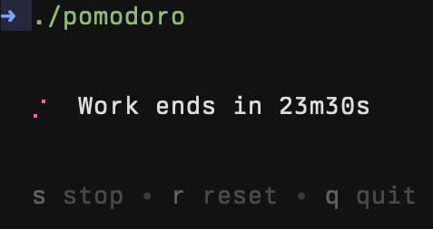

# Pomodoro


A minimalist terminal-based Pomodoro timer written in Go using [Bubble Tea](https://github.com/charmbracelet/bubbletea). Automatically switches between work and break sessions, and supports macOS notifications and sound.



## Features

- Work (25 min) and break (5 min) timers
- macOS system notifications (via `osascript`)
- Sound alerts using system audio (via `afplay`)
- Simple, clean terminal UI

## Requirements

- Go 1.20+
- macOS (for notifications and sound support)

## Installation

```bash
git clone https://github.com/lukeramljak/pomodoro
cd pomodoro
go mod tidy
go run ./cmd/main
```

## Notifications

By default, `osascript` does not have permission to send notifications. To enable:

1. Open Script Editor.app
2. Paste: `display notification "hello" with title "hi"`
3. Click the Play icon
4. Approve the notification permission prompt
